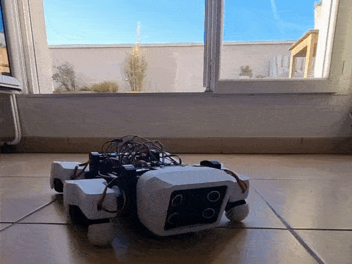

# SpotMicro 

This is my software for my ESP-32 based SpotMicro using Espressif IoT Development Framework.

Original SpotMicro can be found [here on thingiverse](https://www.thingiverse.com/thing:3445283) but the one I built
is [a remix](https://www.thingiverse.com/thing:4559827) that use an ESP-32 instead of an Arduino.

Assembly instructions and more informations for this SpotMicro variant can be found [here](https://github.com/michaelkubina/SpotMicroESP32).



## Getting started
### Install ESP-IDF

Follow this doc: https://docs.espressif.com/projects/esp-idf/en/latest/esp32/get-started/index.html

I chose to use the VS Code extension

### Setup esp-idf components library

Follow this doc: https://esp-idf-lib.readthedocs.io/en/latest/

```bash
git clone https://github.com/UncleRus/esp-idf-lib ~/esp/esp-idf-lib
```

## Links
- https://github.com/michaelkubina/SpotMicroESP32
- https://esp-idf-lib.readthedocs.io/en/latest/groups/pca9685.html
- https://discord.gg/s8F6xHGk9Y (#spotmicro-esp32)